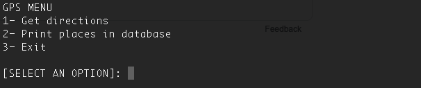
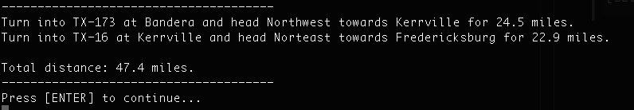

# Path Finding Algorithm using linked nodes

This C++ software implements Dijkstra's algorithm to find the shortest path between linked nodes, that represent locations.</br>

Custome data structures are used:</br>
- array list
- linked list
- doubly linked list

## Compile and run

Run ```make``` to compile the source code.</br>

Run ```./path``` to execute the program</br>

Select option [1] from menu.</br>


Enter a string to search for a location and select one from the list. Similarly, search for a destination.</br>


View the directions.</br>


